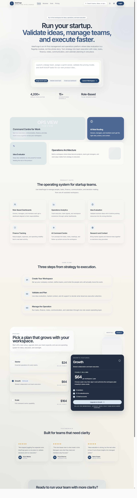

# IdeaForge

IdeaForge is a full-stack MERN SaaS productivity workspace for managing projects, tasks, teams, meetings, notifications, analytics, reports, global search, and Google productivity integrations from one deployed application.

## Important Links

| Resource | Link |
| --- | --- |
| Figma Design | https://www.figma.com/design/iUslU2uk6IbPU48cxKlJkL/KHUSH-PATEL-s-team-library?node-id=0-1&t=NMUYd8hYekwe11vh-1 |
| Live Deployed Project | https://crmideaforge.onrender.com |
| Backend Deployed API | https://crmideaforge.onrender.com/api |
| Postman Documentation | https://documenter.getpostman.com/view/50839203/2sBXqKoKkY |
| YouTube Demo | https://youtu.be/lJTuWU8b9Tg |
| Personal GitHub Repository | https://github.com/khushpatel143/ideaForge |
| Official Coding Gita Repository | https://github.com/codinggita/ideaForge |
| Assignment Checklist | https://github.com/codinggita/CGxSU_Semester_1/blob/main/assignments/04.sem2_full_stack_60_Marks_Project_01/01.features_checklist.md |

## Problem Statement

Startup teams and student project teams often manage ideas, tasks, meetings, project updates, team members, and productivity tools across disconnected platforms. This creates scattered communication, unclear task ownership, weak visibility, and difficulty tracking progress from idea to execution.

## Solution

IdeaForge solves this by providing a single SaaS-style workspace where users can authenticate, manage projects, create and assign tasks, collaborate in teams, schedule meetings, track dashboard analytics, view reports, search globally, receive notifications, and connect Google services such as OAuth, Gmail, and Calendar.

The platform is built with a production-ready MERN architecture, deployed on Render, connected to MongoDB Atlas, and documented with Postman for API evaluation.

## Features

- Landing page with modern SaaS-style UI.
- Email/password authentication with HTTP-only JWT cookies.
- Google OAuth authentication.
- User profile, security, notifications, and billing-readiness settings.
- Dashboard with stats, recent projects, today's tasks, meetings, Gmail preview, and AI-style briefing.
- Project CRUD with personal and team-scoped project access.
- Task CRUD with due dates, completion updates, project linking, team linking, and assignment support.
- Team collaboration with owner, admin, and member roles.
- Team member add, remove, and role update workflows.
- Local meeting CRUD with Calendar page integration.
- Google Calendar integration for upcoming and monthly events.
- Gmail integration for recent email preview.
- Notification inbox with read and read-all actions.
- Global search across application data.
- Reports dashboard with custom analytics and canvas charts.
- Quick Action modal for creating project, task, team, or meeting from anywhere.
- Protected routes and session-aware navigation.
- Responsive frontend design for desktop and mobile.
- SEO support using dynamic meta tags, Open Graph tags, sitemap, and robots file.
- API documentation published with Postman.

## Tech Stack

### Frontend

- React.js
- Vite
- React Router
- Tailwind CSS
- Material UI
- Redux Toolkit
- Formik and Yup
- Axios
- React Helmet Async
- Framer Motion
- Lucide React

### Backend

- Node.js
- Express.js
- MongoDB Atlas
- Mongoose
- JWT authentication
- HTTP-only cookies
- bcryptjs
- Google APIs

### Tools and Deployment

- Render
- MongoDB Compass
- Postman
- GitHub
- Google Cloud Console
- Figma

## Folder Structure

```txt
IdeaForge/
  backend/
    config/
      db.js
    controllers/
      calendarController.js
      dashboardController.js
      gmailController.js
      googleAuthController.js
      meetingController.js
      notificationController.js
      projectController.js
      reportController.js
      searchController.js
      taskController.js
      teamController.js
      userController.js
    middleware/
      authMiddleware.js
      errorMiddleware.js
    models/
      meetingModel.js
      notificationModel.js
      projectModel.js
      taskModel.js
      teamModel.js
      userModel.js
    routes/
      calendarRoutes.js
      dashboardRoutes.js
      gmailRoutes.js
      googleAuthRoutes.js
      meetingRoutes.js
      notificationRoutes.js
      projectRoutes.js
      reportRoutes.js
      searchRoutes.js
      taskRoutes.js
      teamRoutes.js
      userRoutes.js
    utils/
      generateToken.js
    server.js
  frontend/
    public/
      robots.txt
      sitemap.xml
    src/
      components/
      context/
      hooks/
      pages/
      services/
      store/
      utils/
      App.jsx
      main.jsx
```

## Project Screenshots

### Landing Page

The landing page presents IdeaForge as an AI-first MERN SaaS workspace for startup operations, project planning, team workflows, pricing, and execution.



## API Overview

Base API URL:

```txt
https://crmideaforge.onrender.com/api
```

Main API modules:

- `/api` - health check
- `/api/users` - register, login, logout, profile
- `/api/auth/google` - Google OAuth login, callback, and debug
- `/api/projects` - project CRUD
- `/api/tasks` - task CRUD
- `/api/teams` - team and member management
- `/api/meetings` - meeting CRUD
- `/api/calendar` - Google Calendar data
- `/api/gmail` - Gmail recent emails
- `/api/dashboard` - dashboard stats
- `/api/reports` - report analytics
- `/api/notifications` - notification inbox
- `/api/search` - global search

Full API documentation:

```txt
https://documenter.getpostman.com/view/50839203/2sBXqKoKkY
```

## SEO Implementation

- Dynamic route-level titles and meta descriptions.
- Open Graph metadata for better sharing previews.
- Twitter card metadata.
- Schema.org `SoftwareApplication` structured data.
- `robots.txt` included in frontend public assets.
- `sitemap.xml` included in frontend public assets.
- Production canonical URL configured for the deployed Render app.

## Official Checklist Coverage

The project implements the important features expected in the Coding Gita full-stack checklist:

- React project setup with clean component structure.
- Routing with public and protected pages.
- Authentication and route protection.
- API integration using Axios.
- Reusable components, forms, modals, cards, sidebar, and dashboard widgets.
- Form validation with Formik and Yup.
- State management with Redux Toolkit and Context.
- MongoDB models and relationships.
- Express REST APIs with controllers, routes, middleware, and error handling.
- CRUD operations for projects, tasks, teams, and meetings.
- Local storage/session storage usage for non-sensitive UI state.
- HTTP-only cookie usage for JWT security.
- Google OAuth and Google API integrations.
- Responsive UI.
- SEO implementation.
- Deployment-ready production build.
- Postman documentation.

## Local Setup

### Backend

```bash
cd backend
npm install
cp .env.example .env
npm run dev
```

Required backend environment variables:

```env
NODE_ENV=development
PORT=5000
MONGO_URI=your_mongodb_connection_string
JWT_SECRET=your_long_random_secret
FRONTEND_URL=http://localhost:5173
CORS_ORIGIN=http://localhost:5173
GOOGLE_CLIENT_ID=your_google_client_id
GOOGLE_CLIENT_SECRET=your_google_client_secret
GOOGLE_CALLBACK_URL=http://localhost:5000/api/auth/google/callback
```

### Frontend

```bash
cd frontend
npm install
cp .env.example .env
npm run dev
```

Frontend environment variables:

```env
VITE_API_BASE_URL=/api
VITE_GA_MEASUREMENT_ID=
VITE_PUBLIC_APP_URL=http://localhost:5173
```

Local frontend URL:

```txt
http://localhost:5173
```

## Deployment

The project is deployed on Render as a MERN monorepo where the Express backend serves the Vite frontend production build.

Production URLs:

```txt
Frontend: https://crmideaforge.onrender.com
Backend API: https://crmideaforge.onrender.com/api
```

Required production environment variables:

```env
NODE_ENV=production
PORT=10000
MONGO_URI=your_mongodb_atlas_connection_string
JWT_SECRET=your_long_random_secret
FRONTEND_URL=https://crmideaforge.onrender.com
CORS_ORIGIN=https://crmideaforge.onrender.com
GOOGLE_CLIENT_ID=your_google_client_id
GOOGLE_CLIENT_SECRET=your_google_client_secret
GOOGLE_CALLBACK_URL=https://crmideaforge.onrender.com/api/auth/google/callback
DNS_SERVERS=1.1.1.1,8.8.8.8
```

Google Cloud OAuth redirect URI:

```txt
https://crmideaforge.onrender.com/api/auth/google/callback
```

## Validation

Frontend production build:

```bash
cd frontend
npm run build
```

Latest build status: passed.

## AI Assistance Disclosure

This project was initially developed with Antigravity assistance and later refined with Codex assistance for final-phase implementation, checklist mapping, deployment fixes, SEO, README updates, and Postman documentation support.

## Author

Khush Patel
